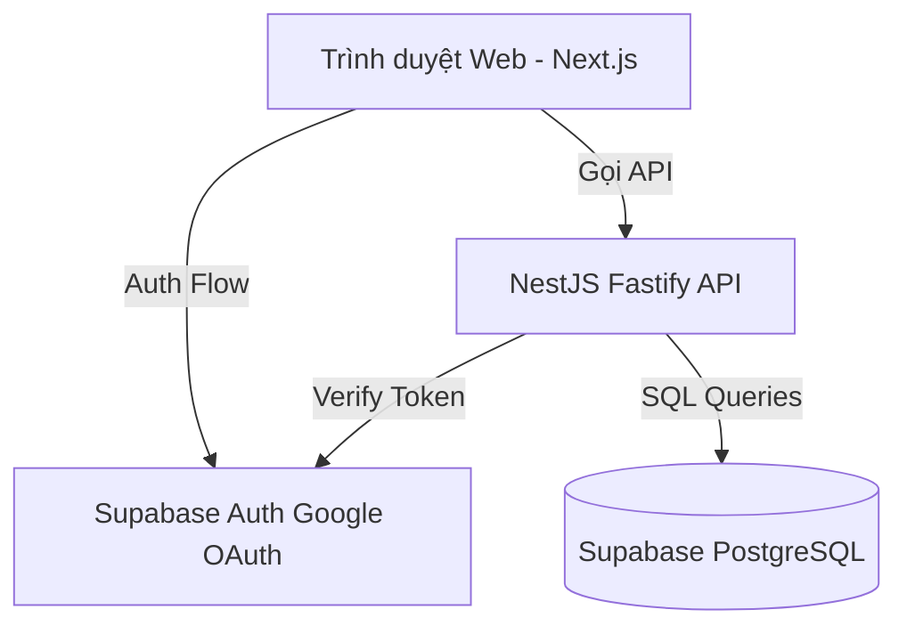

# PGS Hub - Tài liệu Kiến trúc Hệ thống

Tài liệu mô tả kiến trúc tổng quát của PGS Hub.

## 1. Tổng quan Kiến trúc
Hệ thống được thiết kế theo mô hình **Monorepo** sử dụng **Turborepo** và **pnpm workspaces**. Kiến trúc tách biệt rõ ràng giữa lớp hiển thị (Frontend Next.js) và lớp nghiệp vụ (Backend NestJS API).

## 2. Các thành phần chính
- **Next.js (`apps/web`)**: Web App đảm nhận phần render giao diện, quản lý route và trạng thái của client. Toàn bộ thao tác trao đổi dữ liệu nghiệp vụ đều phải thông qua API.
- **NestJS API (`apps/api`)**: Cổng dịch vụ trung tâm chạy trên Fastify adapter, xử lý xác thực token JWT từ Supabase, kiểm tra quyền hạn chi tiết và tương tác trực tiếp với Database.
- **Shared Packages (`packages/*`)**:
  - `database`: Quản lý schema tập trung bằng Drizzle ORM.
  - `permissions`: Định nghĩa duy nhất danh sách quyền và vai trò hệ thống.
  - `auth`: Client factory hỗ trợ khởi tạo Supabase Client thống nhất.
  - `validation`: Zod schemas đồng bộ validation hai đầu Client-Server.

## 3. Quy chuẩn Bảo mật & Thiết kế
- **RLS (Row-Level Security)**: Luôn bật trên tất cả các bảng public trong PostgreSQL để ngăn chặn các truy vấn trái phép từ client-side bypass API.
- **Data Access Control**: Client không bao giờ kết nối trực tiếp database hoặc PostgREST của Supabase để sửa dữ liệu; mọi yêu cầu chỉnh sửa bắt buộc đi qua NestJS API để ghi nhận lịch sử hoạt động (Audit log).
