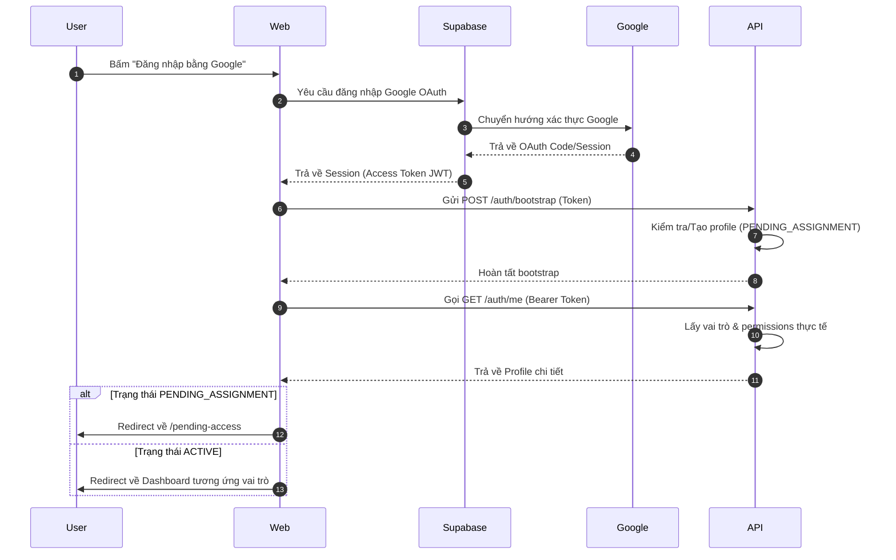

# Quy trình Xác thực - PGS Hub Authentication Flow

Tài liệu mô tả luồng xác thực người dùng sử dụng Supabase Auth kết hợp Google OAuth.

## 1. Biểu đồ Quy trình (Authentication Flow)

## 2. Các điểm lưu ý quan trọng
- **Xác thực Google OAuth**: Phương thức duy nhất được hiển thị trên giao diện.
- **Trạng thái Mặc định**: Bất kỳ người dùng nào đăng ký mới đều nhận trạng thái `PENDING_ASSIGNMENT`. Admin phải phê duyệt trước khi họ có thể xem bất kỳ dữ liệu nào của công ty.
- **Xác minh JWT**: API NestJS sử dụng JWT Key của Supabase để kiểm tra tính hợp lệ của token trong Header `Authorization: Bearer <token>`.
